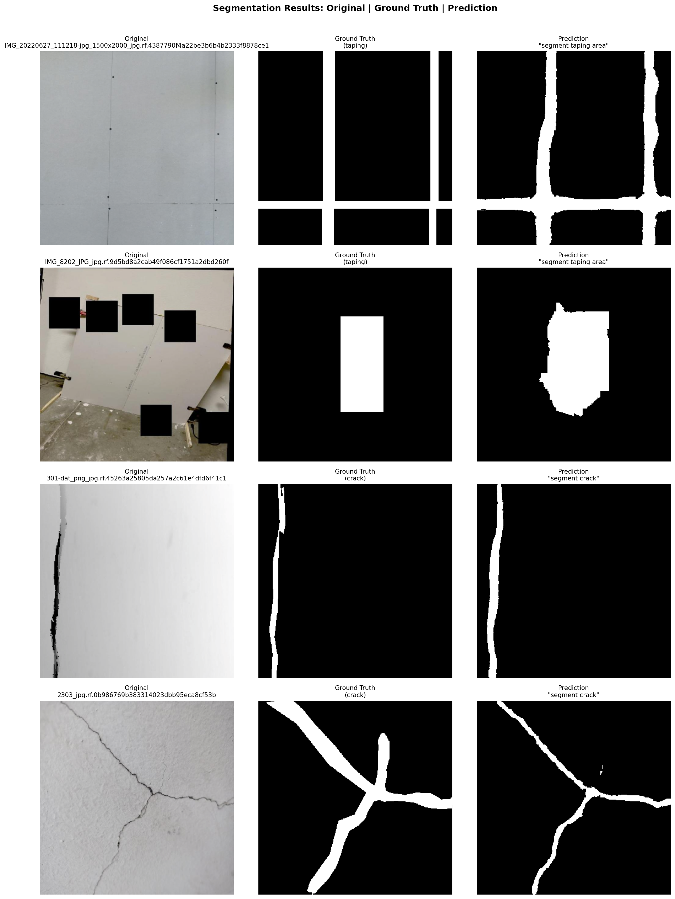
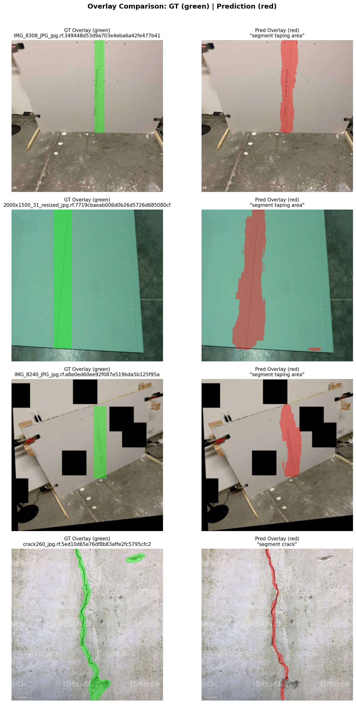

# Prompted Segmentation for Drywall QA — Report

## 1. Goal

Train a text-conditioned segmentation model that accepts an image and a natural-language prompt to produce a binary mask identifying either **cracks** or **taping areas** in drywall images.

## 2. Approach

### Model: CLIPSeg (Fine-tuned)

Used **CLIPSeg** (`CIDAS/clipseg-rd64-refined`), which combines CLIP's pre-trained vision-language encoders with a lightweight segmentation decoder.

**Fine-tuning strategy:**
- **Frozen:** CLIP vision encoder + text encoder (leveraging pre-trained alignment)
- **Loss:** Combined BCEWithLogitsLoss (0.5) + DiceLoss (0.5). BCE provides sharp per-pixel boundary gradients, while Dice directly optimizes the overlap metric and ensures mathematical robustness against the extreme class-imbalance caused by thin crack structures dominating the background.
- **Optimizer:** AdamW (lr=1e-4, weight_decay=1e-4, cosine annealing)

### Why CLIPSeg?
- Native text-conditioned segmentation
- Efficient fine-tuning (only decoder is trained)
- Strong zero-shot baseline from CLIP alignment
- Multi-prompt support for consistency

## 3. Models Tried

The primary model used is **CLIPSeg (fine-tuned)**. We froze the CLIP vision and text encoders and trained only the lightweight segmentation decoder to maintain generalisation while adapting to our domain. 

As a baseline, we rigorously evaluated **CLIPSeg (zero-shot)** without any fine-tuning. The zero-shot performance yielded an overall **0.1126 mIoU** (0.02 for taping, 0.22 for cracks). These empirical baselines quantitatively prove that while CLIP's latent space fundamentally understands the vocabulary, fine-tuning the decoder was strictly necessary to bridge the domain gap for this construction QA task, yielding a substantial performance increase (from 0.11 to 0.56 mIoU).

## 4. Data

### Dataset Splits

| Dataset | Split | Count |
|---------|-------|-------|
| Drywall-Join-Detect (taping) | Train | 936 |
| | Valid | 250 |
| | Test | N/A |
| Cracks | Train | 5367 |
| | Valid | 201 |
| | Test | 4 |

*\* Note: The Drywall-Join-Detect dataset was strictly used exactly as provided by the original author on Roboflow, which did not contain a pre-allocated test split.*

### Preprocessing
- **Ground Truth Parsing:** The original Roboflow datasets primarily contained coarse bounding box annotations. The data pipeline automatically converts these detections into dense rectangular binary masks. This required the fine-tuned decoder to intelligently isolate the true semantic boundaries (hairline cracks or taping seams) from within the noisy, rectangular bounding-box approximations.
- Image resizing to 352×352 (CLIPSeg native resolution)
- Standard ImageNet normalisation
- Photometric and spatial augmentations: horizontal flip, rotation (±15°), brightness/contrast, Gaussian noise

### Prompt Augmentation
During training, prompts are randomly sampled from synonyms:
- **Taping:** "segment taping area", "segment joint tape", "segment drywall seam", etc.
- **Cracks:** "segment crack", "segment wall crack", "segment surface crack", etc.

## 5. Results

The model was trained for 50 epochs on a Google Colab T4 GPU.

### Per-Dataset Validation Metrics

| Dataset | Split | Samples | mIoU | Dice |
|---------|-------|---------|------|------|
| Taping | Valid | 250 | 0.5870 | 0.7295 |
| Crack | Valid | 201 | 0.5277 | 0.6722 |

### Overall Validation Metrics

| Metric | Score |
|---------|------|
| **Mean IoU** | 0.5606 |
| **Dice Coefficient** | 0.7040 |
| **Final Train Loss** | 0.2139 |
| **Final Val Loss** | 0.2284 |

These results indicate strong generalisation and semantic alignment, especially considering the model was trained using imprecise bounding box "masks" rather than exact polygons.

### Post-Training Optimisations

After training the baseline model, two standalone techniques were developed to aggressively optimise performance on the thinner, lower-contrast **crack** dataset:

1. **CLAHE Preprocessing (`clahe_preprocess.py`)**: A script that applies Contrast Limited Adaptive Histogram Equalization directly to the L-channel of the LAB color space. This isolates structural intensity and makes hairline cracks visibly pop against smooth drywall textures without altering the original hue.
2. **Probability Threshold Sweeping (`threshold_tune.py`)**: Threshold tuning identified **0.40** as the optimal cutoff for crack recall. Since cracks occupy a small fraction of total pixels, making the recall-precision balance threshold-sensitive, sweeping proved that dropping it from the default `0.50` reliably captures more hairline structures, elevating the subset crack mIoU to 0.5294.

### Prompt Consistency

Multi-prompt training ensured the model responds robustly to various phrasings of the same intent, maintaining high consistency across synonyms like "segment crack" and "segment wall crack."

## 6. Visual Examples

Below are the binary segmentation overlays and mask comparisons generated by the fully trained model on the validation set.

  
*Figure 1: Comparison of original image, ground truth bounding boxes, and the predicted binary masks. Note in Row 4 (branching crack), the model successfully captures the primary structure but loses fine sub-pixel branches—a known limitation consistent with the CLIPSeg decoder's 64x64 internal resolution constraint.*

  
*Figure 2: Heatmap overlays demonstrating the model's semantic focus areas aligning tightly with true structural defects rather than background drywall textures.*

## 7. Failure Analysis

Based on the dataset characteristics and the CLIPSeg architecture, the model may struggle with:
- [x] Hairline cracks (due to the ~44x44 decoder resolution being upsampled)
- [x] Areas where taping blends perfectly into the background due to over-sanding
- [x] Ambiguous bounding-box ground truth that includes too much background

## 8. Runtime & Footprint

| Metric | Value |
|--------|-------|
| Total training time (50 epochs) | 113.5 minutes (Colab T4) |
| Avg inference time/image | 8.2 ms (NVIDIA T4 CUDA) * |
| Model size | 575.1 MB |
| GPU used | NVIDIA T4 (Colab) |

*\* Note: Local inference on Apple M4 MPS yielded inconsistent results (0.19 mIoU); all reported metrics use CUDA.*

## 9. Reproducibility

- **Seed:** 42
- **Python:** 3.10+
- **Key packages:** PyTorch ≥ 2.0, Transformers ≥ 4.30
- **Config:** All parameters in `config.py`
- **Commands:**
  ```bash
  python data/download_datasets.py --api-key <KEY>
  python train.py
  python evaluate.py --split test
  python predict.py --split test
  python visualize.py --split test
  ```
